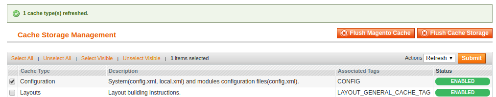
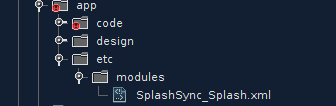
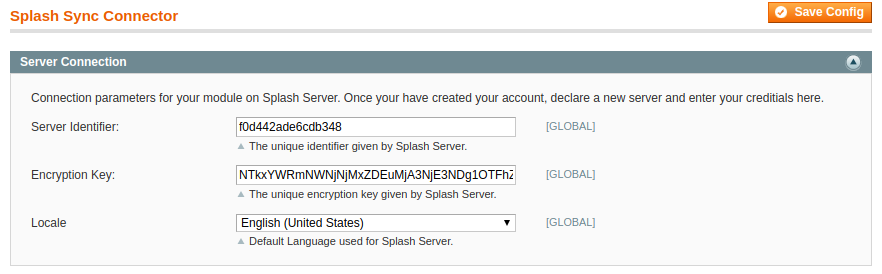
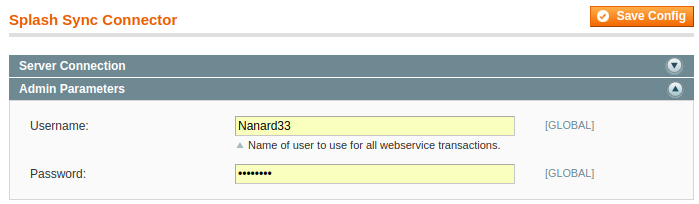
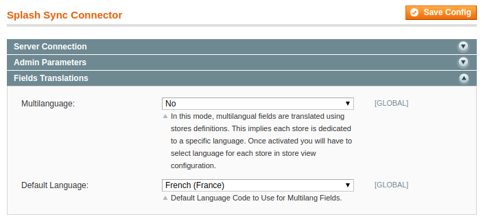
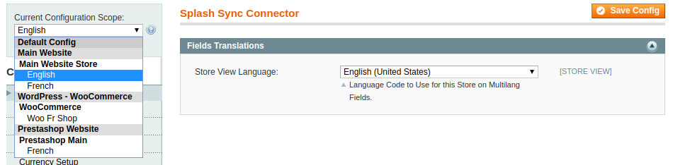
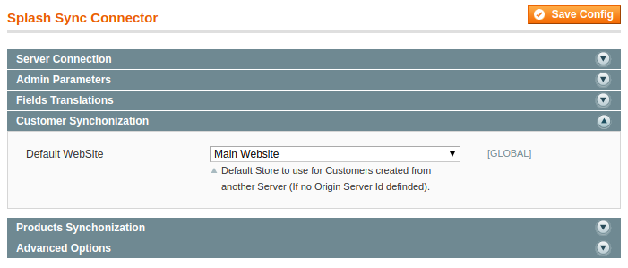
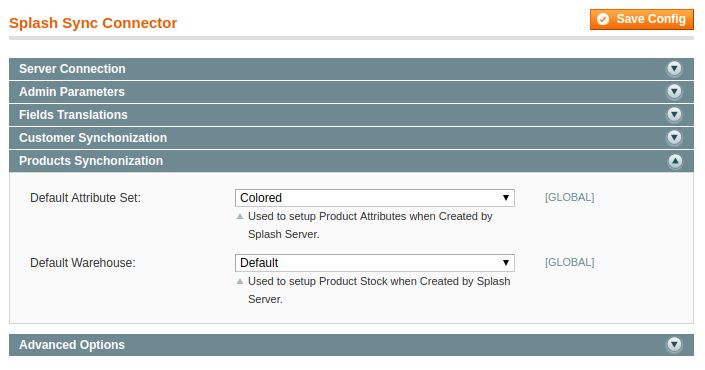
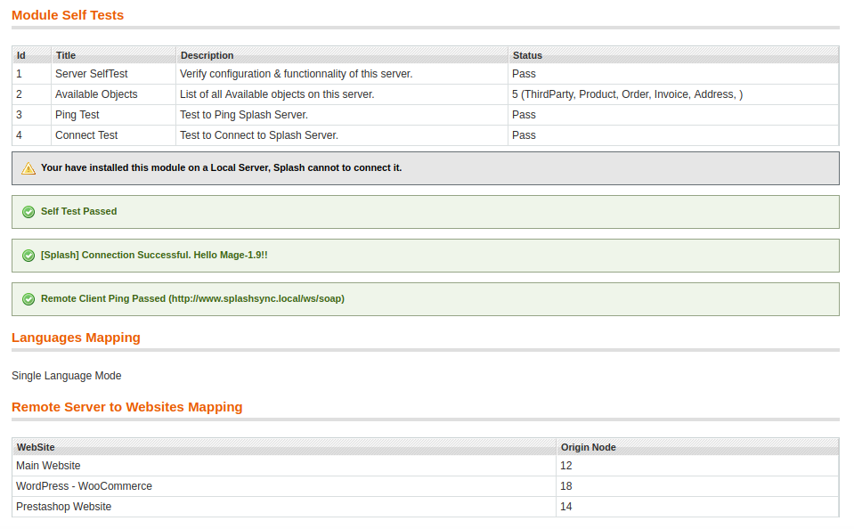

### Enable the Module

Splash Module should be automatically enabled when you copy files on Magento.

If it doesn't, follow these two steps:
* Clear Magento cache from **System >> Cache Management >> Configuration Cache**

* Check Module declaration file is present on your server

If you have "404 Error" when accessing module configuration page, just **Logout & Login** in order to update ACL configuration.

### Configure the Module

Splash Module configuration is located on **System >> Configuration** then **Services >> Splash Sync Connector**.

### Connect to your Splash Account

First, you need to create access keys for you module in our website. To do so, on Splash workspace, go to **Servers** >> **Add a Server** and note your id & encryption keys.

Then, enter the keys on Plugin's configuration (take care not to forget any character).

##### Default Language

Select which language package module should use for communication with Splash Server.

### Setup default Parameters

To work correctly, this module need few parameters to be selected.

##### Default User

Enter Login & Password of the user that will be used for all actions executed by Splash Module.

We highly recommend creation of a dedicated user for Splash.

Be aware Splash Module will take care of Users rights policy, this user must have appropriated right on Magento.

##### Fields Translation

With Splash, it is possible to sync Multilingual fields. This is mainly used for Products Catalogs synchronization.

If your store only uses a single language, leave this parameter to **No** and select your store language.

If you have a multilingual store, select **Yes** and an option will be shown on each Store View to select associated language.

##### Customers Synchronization

If you decide to import Customers from another site, you must define here the website Splash should use on Magento to create their profiles.

If you have multiple servers, it is also possible to select multiple websites, this is done on at website level configuration.

The server number is the one in the **#** column of your server list.

##### Products Synchronization

If you decide to import Products from other sites, you must select their default parameters.

* Default Attribute set
* Default Warehouse

### Check results of Self-Tests

Once your module is ready, or each time you update your settings, you have to check your configuration.

To do so, goes to Module's Web Service page : **System >> Web Services >> SOAP - Splash Sync**

Each time you update your configuration, module will verify your parameters and ensure communication with Splash is working fine.

Ensure all tests are passed... this is critical! Also check the rest of your configuration, mainly Languages & Websites mapping.

**Note** If you server wasn't connected yet, this will be done when loading this page.

